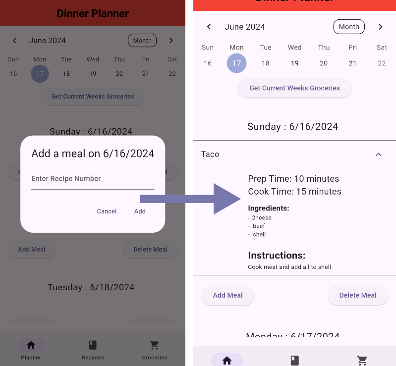

# CIS 350 Project

## Dinner Planner App

---

## Made by

### Nathan Barber

### Rylan Bernhardt

---

## Important Links

### [Github](https://github.com/Rjbern/CIS-350-Project)

### [JIRA](https://mail-team-otacijvt.atlassian.net/jira/software/projects/C3P/boards/2?atlOrigin=eyJpIjoiN2IzZmNkY2E5NmYzNDdhMTg2YWI1NzQ3MWYxYjg2ZjciLCJwIjoiaiJ9)

---

## 1. Abstract

Eating is a part of daily life for all people. We need food to keep our minds and bodies alive and when life gets busy with work, family, school, and other life events finding time to schedule what meals you will eat on what days and what ingredients you need for those can be a big time commitment. This can cause people to skip meals or stop at fast food restaurants due to a lack of organization and time. These both are unhealthy. The idea of the “**Dinner Planner**” is to allow people to mitigate the time-consuming, and sometimes stress-inducing process of meal planning and grocery shopping. The user will be able to add the meal of choice to the day they want to plan it and add the items needed for that meal. The App then will plan the meal for the user and add the items to their list. This will help organize the user's life in an area that gets neglected at times. Food has a big impact on health and allows users to organize and plan what they eat and when can allow them to make better choices for their health.

## 2. Introduction

Flutter allows for the development of mobile applications that can be used across multiple mobile operating systems. This allows for “**Dinner Planner**” to reach most people. Life can get busy pressuring people to make bad eating habits that can affect health negatively. Most people now have mobile devices allowing for the process of organizing their lives to be much easier and less time-consuming. If the user has one of these devices, they will be able to plan their meals and groceries whenever the get the chance so they do not have to make last-minute decisions. After installing “**Dinner Planner**” users will be able to see a calendar of the current week as well as a place to schedule a meal for all seven days of any week.  The users will be able to add or remove custom recipes to the list of possible recipes to schedule.  One recipe can be placed per day in order to plan the upcoming meals.  On another page, the user will be able to see a comprehensive list of groceries needed in order to prepare a given weeks worth of meals.

## 3. Architectural Design

"**Dinner Planner**" was designed around a singluar client side interface.  This means that all storage of data is housed on device. A risk analysis was done in order to decide to go with the architecture shown in Figure 1.

  
   
  Figure 1: Client and Storage Architecture

This architecture design allows a singular user to keep all their data stored on device so no internet connection is needed to run the app.  Additionally, there is no chance that a sever disruption could hinder the user using the app.  Two downsides to this design that were considered were multi-device support and having a backup if the users device were to get damaged.  For the short timeline of this project the simplicity of not having a server made the most sense because the two main issues were more long term itteration changes.

### 3.1 Class Diagram

The class diagram as shown in Figure 2 describes how the code was designed to be layed out.

  
   
  Figure 2: Class Diagram

There are no control classes in this diagram which was a big topic talked about.  The boundary classes have direct interfcaing with the user to perform their tasks, but since each of these tasks were more of a one and done case it seemed unnecissary to make classes for just a collection of one or two functions for nearly 8 classes.

### 3.2 Use Case Diagram

Major uses of the "**Diner Planner**" were designed about the most crucial elements users would need to interact with.  The use case diagram can be seen in Figure 3.

  
   
  Figure 3: Use Case Diagram

These interactions were decided upon by asking a sample group of people what they would like to see from this type of app.  The most common things said amongst this group is being able to create their own recipe, having a calendar to see what recipe is when, and having an easy way to get a grocery list for any week so shopping is easier.  These are reflected by our choices in designing Figure 2.

### 3.3 Sequence Diagram

The three major interactions come from creating the recipes, linking those recipes to the date the user wants to make that recipe, and gathering the grocieries for a given week.  Figures 4 through 6 show the sequence diagrams for these interactions.

  
   
  Figure 4: Sequence Diagram for Creating Recipes

  
   
  Figure 5: Sequence Diagram for Linking Recipes

  
   
  Figure 6: Sequence Diagram for Getting a Grocery List

### 3.4 Communication Diagram

Communication diagrams are very similart othat of the sequence diagram, but instead of the design being vertical, they form more horizontally.  Figures 7 - 9 show the communication diagrams for the respective sequence diagram.

  
   
  Figure 7: Communication Diagram for Creating Recipes

  
   
  Figure 8: Communication Diagram for Linking Recipes

  
   
  Figure 9: Communication Diagram for Getting a Grocery List

As shown in these diagrams, the numbers represent the order in which the actions take place and the arrows point in which direction the information is flowing.  The sequence and communication diagrams show the same information just can be interperted easier by different people.

## 4. User Guide / Implementation

### 4.1 Home

When the user launches the application they will be greated by the planner page. From here they will be able to naviagte to the Recipes page and Groceries page. The user will have many tools within the planner page.

  
   
  Figure 10: Home Page / Planner Page

### 4.2 Planner Page

On this page, the user will be able to add meals, delete meals, fetch groceries, and change weeks in the calendar.

**4.2.1 Calander**

The user can use the calendar to change from the current week to any week they want to view or plan in. Changing the calendar changes the dates for the planned meals and grocery lists.

  
   
  Figure 11: Showcasing planner page and switching weeks

The purple box highlights the change in week when the user decides to move forward or backwards in time.  It can also be seen that the dates next to the weekdays also change accordingly.

**4.2.2 Add Meal**

If the user has a recipe, they created they can click the 'Add Meal' button and will be prompted to enter the recipe number they want to add. They then can click cancel or add the number, designated in the recipe page, in the prompt.

  
   
  Figure 12: Prompt to Add Meal to the Meal Being Added

Once added they add the meal, the meal appears under the that given day.  This meal has a drop down to see all the information about the recipe. When they have added the meal, the application stores their planned meals in the database on the user's device to be there when the open the app in the future.

**4.2.3 Delete Meal**

If the user no longer wants a meal that they have planned for a specific day, they then have the option to use the 'Delete Meal' button next to the meal to do so. They will be prompted with a screen to verify they want to delete the planned meal with the option to cancel in case of a miss click. When the user deletes the meal, it is deleted from the appropriate spot in the database.

  
   
  Figure 13: Prompted to delete planned meal.

### 4.3 Recipies Page

On this page, the user will be able to see all the recipes that they have created. They will also be able to add new recipes and delete their created recipes.

**4.3.1 Add Recipe**

In the bottom right corner, there is a floating button that allows the user to create a recipe. When clicked they are prompted with a screen to enter the name, prep time, cook time, ingredients, and instructions. They can back out of the prompt if needed. When added the information is now viewable on the recipe page via a drop down page that has all the recipe information. This recipe is then stored in the appropriate spot in the database.

  
   
  Figure 14: Creation Process of Recipes.

**Delete Recipe**

After the user has created recipes, they then have the option to delete them as well. If a recipe is wanted to be deleted this is possible via the bottom of the dropdown of all recipes. Once deleted, the recipe will be removed from the recipe page and the database.

  
   
  Figure 15: Delete button in dropdown.

### 4.4 Groceries Page

This page allows the users to pull all of inregredients from planned meals the selcted week to make a grcoery list.

**4.4.1 Collecting Grocery list**

Users can plan groceries for any given week they choose. Initially the grocery page is empty.  This can be seen in Figure 13.

  
   
  Figure 16: Empty grocery page.

When the user wants to get a grocery list for their week of meals, they first have to navigate to the planner page.  There is a button below the calendar on the Planner page called 'Get Current Weeks Groceries'. This collects all ingredients from meals planned for that week in the database and adds them to your grocery list page.  This allows for the user to get any weeks groceries so they can plan their week in advance.  Figure 14 shows this process.

  
   
  Figure 17: Get Current Week's Groceries.

## 5. Future Scope

For this project, there is some future scope. Now the software does not have a login/register page. This needs to be created and connected to a server/database so users can access their **Dinner Planner App** data on more than just one device. Recipes could be changed so that they can be edited instead of deleted and remade. UI could be smoothed out, so it is more pleasing to the eye. Add the option to specifically plan meals for breakfast, lunch, or dinner on all days for added organization.

## 6. Conclusion

Overall, we believe that the **Dinner Planner App** brings all the features that are necessary for people to plan their meals. It allows users to be more organized with their lives, making it less stressful to figure out what they are going to eat next. We plan on improving this application to make the user's experience even more helpful.

## 7. Walkthrough
