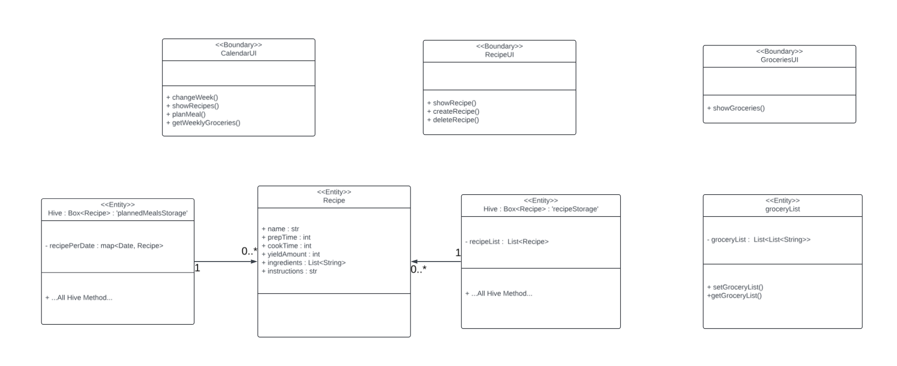

# CIS 350 Project

## Dinner Planner App

## Made by

---

### Nathan Barber

### Rylan Bernhardt

---

## Important Links

---

### JIRA

[https://mail-team-otacijvt.atlassian.net/jira/software/projects/C3P/boards/2?atlOrigin=eyJpIjoiN2IzZmNkY2E5NmYzNDdhMTg2YWI1NzQ3MWYxYjg2ZjciLCJwIjoiaiJ9](https://mail-team-otacijvt.atlassian.net/jira/software/projects/C3P/boards/2?atlOrigin=eyJpIjoiN2IzZmNkY2E5NmYzNDdhMTg2YWI1NzQ3MWYxYjg2ZjciLCJwIjoiaiJ9)

### GITHUB

[https://github.com/Rjbern/CIS-350-Project](https://github.com/Rjbern/CIS-350-Project)

---

## 1. Abstract

Eating is a part of daily life for all people. We need food to keep our minds and bodies alive and when life gets busy with work, family, school, and other life events finding time to schedule what meals you will eat on what days and what ingredients you need for those can be a big time commitment. This can cause people to skip meals or stop at fast food restaurants due to a lack of organization and time. These both are unhealthy. The idea of the “**Dinner Planner**” is to allow people to mitigate the time-consuming, and sometimes stress-inducing process of meal planning and grocery shopping. The user will be able to add the meal of choice to the day they want to plan it and add the items needed for that meal. The App then will plan the meal for the user and add the items to their list. This will help organize the user's life in an area that gets neglected at times. Food has a big impact on health and allows users to organize and plan what they eat and when can allow them to make better choices for their health.

## 2. Introduction

Flutter allows for the development of mobile applications that can be used across multiple mobile operating systems. This allows for “**Dinner Planner**” to reach most people. Life can get busy pressuring people to make bad eating habits that can affect health negatively. Most people now have mobile devices allowing for the process of organizing their lives to be much easier and less time-consuming. If the user has one of these devices, they will be able to plan their meals and groceries whenever the get the chance so they do not have to make last-minute decisions. After installing “**Dinner Planner**” users will be able to see a calendar of the current week as well as a place to schedule a meal for all seven days of any week.  The users will be able to add or remove custom recipes to the list of possible recipes to schedule.  One recipe can be placed per day in order to plan the upcoming meals.  On another page, the user will be able to see a comprehensive list of groceries needed in order to prepare a given weeks worth of meals.

## 3. Architectural Design

"**Dinner Planner**" was designed around a singluar client side interface.  This means that all storage of data is housed on device. A risk analysis was done in order to decide to go with the architecture shown in Figure 1.

  
   
  Figure 1: Client and Storage Architecture

This architecture design allows a singular user to keep all their data stored on device so no internet connection is needed to run the app.  Additionally, there is no chance that a sever disruption could hinder the user using the app.  Two downsides to this design that were considered were multi-device support and having a backup if the users device were to get damaged.  For the short timeline of this project the simplicity of not having a server made the most sense because the two main issues were more long term itteration changes.

### 3.1 Class Diagram

  
   
  Figure 2: Class Diagram

### 3.2 Use Case Diagram

Major uses of the "**Diner Planner**" were designed about the most crucial elements users would need to interact with.  The use case diagram can be seen in Figure 3.

  
   
  Figure 3: Use Case Diagram

These interactions were decided upon by asking a sample group of people what they would like to see from this type of app.  The most common things said amongst this group is being able to create their own recipe, having a calendar to see what recipe is when, and having an easy way to get a grocery list for any week so shopping is easier.  These are reflected by our choices in designing Figure 2.

### 3.3 Sequence Diagram

The three major interactions come from creating the recipes, linking those recipes to the date the user wants to make that recipe, and gathering the grocieries for a given week.  Figures 4 through 6 show the sequence diagrams for these interactions.

  
   
  Figure 4: Sequence Diagram for Creating Recipes

  
   
  Figure 5: Sequence Diagram for Creating Recipes

  
   
  Figure 6: Sequence Diagram for Creating Recipes

## 4. User Guide / Implementation

### 4.1 Home

When the user launches the application they will be greated by the Planner page. From here they will be able to naviagte to the Recipes page and Groceries page. The user will have many tools within the planner page.

  
   
  Figure 7: Page the users will see when they open the application.

### 4.2 Planner Page

**4.2.1 Calander**

The user can use the calendar to change from the current week to any week they want to view or plan in. Changing the calendar changes the dates for the planned meals and grocery lists.

  

    
     
    Figure 7: Showcasing the change in week in the planner dates.
  

  

    
     
    Figure 8: Calendar Change
  

**4.2.2 Add Meal**

If the user has a recipe, they created they can click the 'Add Meal' button and will be prompted to enter the recipe number they want to add. They then can click cancel or add in the prompt. Once added they can drop down the meal to see all the information about the recipe.

  

    
     
    Figure 9: Prompted to add recipe number when user clicks add meal. 
  

  

    
     
    Figure 10: Added meal to day that the user wanted. 
  

**4.2.3 Delete Meal**

If the user no longer wants a meal that they have planned for a specific day, they then have the option to use the 'Delete Meal' button next to the meal to do so. They will be prompted with a screen to verify they want to delete the planned meal with the option to cancel in case of a miss click. 

  

    
     
    Figure 11: Prompted to delete planned meal. 
  

  

    
     
    Figure 12: Meal deleted. 
  

## 5. Future Scope

## 6. Conclusion

## 7. Walkthrough
